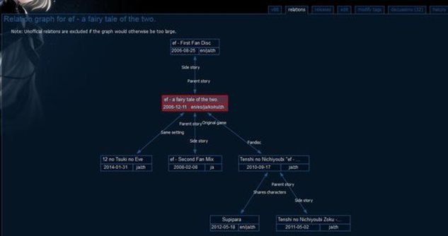

ef世界树？——图源为vndb

 
前几久我已经完善了右下角那部巨冷门的外传相关信息，所以现在图中只有sfm(游戏第二部的先行版本，可以类比动画pv)是没有zh标注——即未汉化的，音羽教会汉化组的厨力实在恐怖。。。

游戏和动画虽说各有优劣，但普遍评价上游戏更高得多，毕竟故事内核而不是表现形式才是感染人心的关键嘛。所以如果认为自己能静下心看这种视觉小说的，请直接玩游戏，之后有时间再去看看动画（会动的老婆们[划掉]）。
然后萌新入坑游戏的话只要按照first-latter-日曜日-fdex日曜日续-日曜日小游戏来就行了。

顺便一提图中还缺漏了个日曜日的小游戏，是以优子sama为主视角的马里奥(划掉)，不过我提供的源是有的。这个非常建议玩一下，挺有意思的，主要是声优配得实在太萌了啊。(vndb的词条找机会看心情补上)

